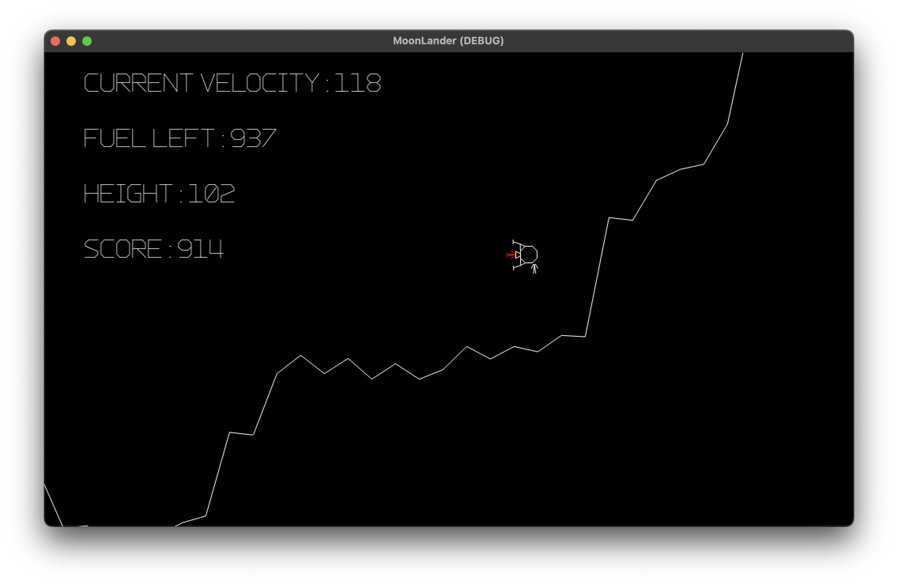
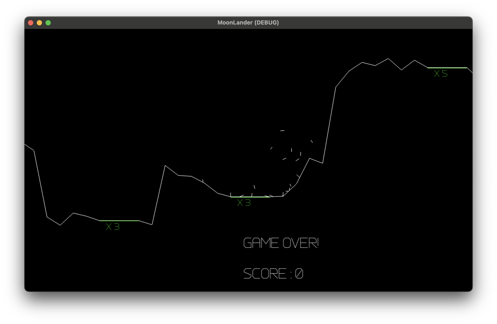

# Moon Lander

## Description
Moon Lander is a recreation of the classic video game, created for the Computer Museum of America as an interactive component of the [Apollo 11](https://www.computermuseumofamerica.org/exhibits/#apollo) exhibit.

